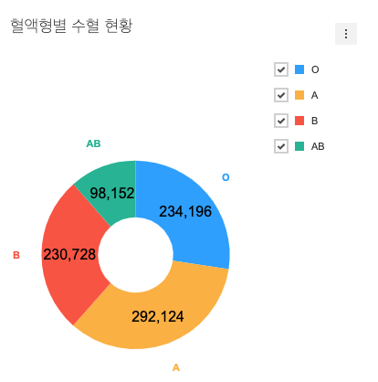

###################
도넛 차트에 추가 옵션 적용해보기
###################

도넛 차트에 :code:`series.showLabel` 옵션 적용하기
=====================

:code:`series.showLabel` 옵션을 사용하여 도넛 차트 내에 수치를 표현할 수 있습니다.

.. code-block:: javascript

  // src/index.js

  ...
  const donutChartOptions = {
    ...
    series: {
      ...
      showLabel: true
    }
  };

:code:`series.showLabel` 옵션 적용 방법에 대해 좀 더 궁금하다면 아래 위키 문서를 확인하세요.

- |link_1|

도넛 차트에 :code:`chart.format` 옵션 적용하기
=====================

:code:`series.showLabel` 옵션을 적용하여 나타난 값이 number 포맷으로 나오지 않아서 어색한 부분을 확인할 수 있습니다.
앞서 살펴봤던 차트의 일반적인 기능을 소개하는 문서에서 값을 포맷팅 하는 부분을 찾아 아래처럼 적용하여 숫자 형식으로 포맷팅 합니다.

.. code-block:: javascript

  // src/index.js

  const donutChartOptions = {
    chart: {
      ...
      format: '1,000'
    }
    ...
  };

도넛 차트에 :code:`series.showLegend`, :code:`series.labelAlign` 옵션 적용하기
=====================

:code:`series.showLegend` 및 :code:`series.labelAlign` 옵션 적용 방법을 알아 봅니다.

미리 적용해 놓은 옵션 위에 문서에서 확인한 옵션을 추가로 적용합니다.

.. code-block:: javascript

  // src/index.js

  //...
  const donutChartOptions = {
      ...
      series: {
        ...
        showLegend: true,
        labelAlign: 'outer'
      }
  };

:code:`series.showLegend`, :code:`series.labelAlign` 옵션에 대해 좀 더 궁금하다면 아래 링크를 확인하세요.

- |link_2|

결과 확인
=====================

위 코드의 결과입니다.

.. |link_1| raw:: html 

  <a href="https://github.com/nhn/tui.chart/blob/master/docs/wiki/features-series.md#showing-label-on-series-area" target="_blank">문서 링크</a>

.. |link_2| raw:: html 

  <a href="https://github.com/nhn/tui.chart/blob/master/docs/wiki/chart-types-pie.md#displaying-a-legend-label-to-each-center-of-a-piece-in-the-pie-graph" target="_blank">문서 링크</a>