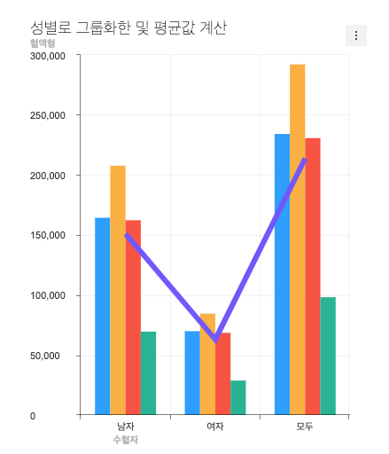

###################
라인-컬럼 콤보차트 생성하기
###################

라인-컬럼 차트를 사용법은 아래 깃헙의 위키 문서에 자세히 설명되어 있습니다.

- |link_1|

라인-컬럼 차트 생성을 위한 raw data 가공하기
=====================

라인-컬럼 차트는 차트 2개를 사용하는 **콤보 차트** 이기 때문에 :code:`lineColumnData.series` 의 형태가 배열이 아닌 객체로 차트 2개에 대한 데이터를 전부 갖고 있습니다.

.. code-block:: javascript

  // src/index.js

  const lineColumnData = {
    categories: ['남자', '여자', '모두'],
    series: {
      column: [
        {
          name: 'O',
          data: [164350, 69846, 234196]
        },
        {
          name: 'A',
          data: [207708, 84416, 292124]
        },
        {
          name: 'B',
          data: [162275, 68453, 230728]
        },
        {
          name: 'AB',
          data: [69444, 28708, 98152]
        },
      ],
      line: [
        {
          name: 'Average',
          data: [150944, 62855, 213800]
        }
      ]
    }
  };

라인-컬럼 차트 생성을 위한 기본 옵션 만들기
=====================

앞의 **도넛 차트** 에서 처럼 기본 옵션을 만들어 줍니다.

.. code-block:: javascript

  // src/index.js

  const lineColumnOptions = {
    chart: {
      width: 400,
      height: 500,
      title: '성별로 그룹화한 및 평균값 계산',
      format: '1,000'
    },
    yAxis: {
      title: '혈액형'
    },
    xAxis: {
      title: '수혈자'
    }
  };

html에 바 차트를 그리기 위한 공간 만들기
=====================

.. code-block:: html

  // src/index.html

  

라인-컬럼 차트의 인스턴스 만들기
=====================

.. code-block:: javascript

  // src/index.js

  const lineColumnChart = tuiChart.comboChart(document.getElementById('line-column'), lineColumnData, lineColumnOptions);

결과 확인
=====================

위 예제를 잘 따라 오셨을 경우 아래 이미지와 같은 형태의 라인-컬럼 차트가 만들어집니다.

.. |link_1| raw:: html 

  <a href="https://github.com/nhn/tui.chart/blob/master/docs/wiki/chart-types-column-line-combo.md" target="_blank">문서 링크</a>
