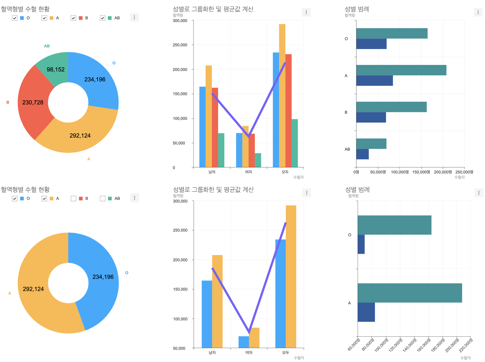
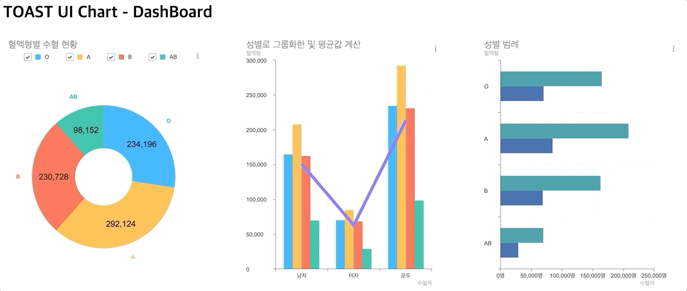

###################
대표차트(도넛 차트)에 범례 체크박스 옵션을 추가하고 차트 전체에 반영되도록 하기
###################

범례 체크박스의 체크 상태가 변경되면 :code:`unchecked` 된 범례는 차트의 그래프에 보이지 않게 됩니다.

이번 단계에서는 대표 차트에서 **범례 체크박스** 를 변경하면 다른 모든 차트에 함께 적용되도록 만듭니다. 앞으로는 이 기능을 **범례 동기화 기능** 이라고 명명하겠습니다.

이해를 돕기 위한 완성된 모습의 이미지입니다. 위 쪽은 **모든 혈액형** 이 선택된 모습이고 아래 쪽은 **O형과 A형** 만 선택된 모습입니다.

아래 링크를 통해 체크박스 옵션 적용에 대해 자세히 알 수 있습니다.

- |link_1|

대표 차트(도넛 차트)를 제외한 모든 차트의 범례 표시 영역을 감추기
=====================

대표 차트에서만 범례를 보이거나 보이지 않도록 설정하고 싶기 때문에 대표 차트를 제외한 차트에서는 범례 체크박스 영역이 필요 없음으로 문서에서 확인한 :code:`legend.visible` 옵션을 활용하여 숨깁니다.

.. code-block:: javascript

  // src/index.js

  //...
  const barChartOptions = {
    ...
    legend: {
      visible: false
    }
  };

  ...
  const lineColumnOptions = {
    ...
    legend: {
      visible: false
    }
  };

대표 차트(도넛 차트)에 차트에 레전드 체크박스 옵션 적용하기
=====================

앞에서 확인했던 위키 문서를 참고하여 대표 차트의 :code:`legend.visible` 옵션을 활성화하고 :code:`legend.align` 옵션으로 차트의 가장 상단에 범례 영역을 위치시킵니다.

.. code-block:: javascript

  // src/index.js

  //...
  const donutChartOptions = {
    ...
    legend: {
      visible: true,
      align: 'top'
    }
  };

이제 도넛 차트에만 혈액형 범례의 체크박스가 나오는 것을 확인할 수 있습니다.

범례 동기화 기능을 구현하기 위하여 위키 문서를 참고하기
=====================

기능을 완성하기 위해서는 아래의 두 가지 차트의 기능을 이용해야 합니다.

1. changeCheckedLegends 이벤트 탐지하기

- |link_2|

2. setData API를 이용해 체크된 데이터만 표시하여 다시 그리기

- |link_3|

체크박스 변경 이벤트 리스너를 구현하여 나머지 차트에 반영시키기
=====================

**1. 대표 차트(도넛 차트)의 changeCheckedLegends 이벤트를 구독하기.**

앞에서 확인한 문서를 바탕으로 대표 차트(도넛 차트)의 :code:`changeCheckedLegends` 이벤트를 가로채어 변경된 범례 정보를 확인합니다.

.. code-block:: javascript

  // src/index.js

  donutChart.on('changeCheckedLegends', info => {
    console.log(info);
  });

**2.** :code:`changeCheckedLegends` **이벤트가 발생할 때마다 나머지 `바 차트`와 `라인-컬럼`차트의 데이터를 변경하여 다시 그려줍니다.**

미리 만들어둔 :code:`reMakeDataForBarChart` 와 :code:`reMakeDataForLineColumnChart` 함수를 이용하여 대표 차트에서 숨기기로 결정된 범례는 나머지 차트에서도 함께 보이지 않도록 데이터를 가공합니다. 함수 구현과 관련하여 **아래 3번 항목** 을 참고해주세요.

.. code-block:: javascript

  // src/index.js

  donutChart.on('changeCheckedLegends', info => {
    const checkedInfo = info[donutChart.chartType];
  
    // For barChart
    barChart.setData(reMakeDataForBarChart(barChartData, checkedInfo));
  
    // For comboChart
    lineColumnChart.setData(reMakeDataForLineColumnChart(lineColumnData, checkedInfo));
  });

**3. "미리 구현한 데이터 가공 함수" 참고**

가공 함수의 역할은 대표 차트의 **혈액형 범례** 에서 그래프로 그리지 않기로 결정된 혈액형에 대하여 나머지 차트 데이터에서도 제거하여 줍니다.

**라인-컬럼 차트** 는 사실 차트 2개(라인 차트, 컬럼 차트)가 합쳐진 **콤보 차트** 이므로 **라인 차트 가공 함수** 와 **컬럼 차트 가공 함수** 를 함께 구현합니다.

.. code-block:: javascript

  // src/index.js

  // 바 차트 가공
  function reMakeDataForBarChart(originalData, checkedInfo) {
    const barChartSeriesData = originalData.series;
    const newBarChartSeriesData = barChartSeriesData.map(seriesItem => ({
      name: seriesItem.name,
      data: Array.from(seriesItem.data).filter((value, valueIdx) => checkedInfo[valueIdx])
    }));
  
    return {
      categories: Array.from(originalData.categories).filter((value, valueIdx) => checkedInfo[valueIdx]),
      series: newBarChartSeriesData
    };
  }
  
  // 라인-컬럼 차트 가공
  function reMakeDataForLineColumnChart(originalData, checkedInfo) {
    const comboChartSeriesData = originalData.series;
  
    return {
      categories: originalData.categories,
      series: {
        column: reMakeDataForColumnChart(comboChartSeriesData.column, checkedInfo),
        line: reMakeDataForLineChart(comboChartSeriesData.line, comboChartSeriesData.column, checkedInfo)
      }
    };
  }
  
  // 컬럼차트 가공
  function reMakeDataForColumnChart(originalData, checkedInfo) {
    return originalData.map((seriesItem, idx) => (
      Object.assign({}, seriesItem, {visible: checkedInfo[idx]})
    ));
  }
  
  // 라인차트 가공
  function reMakeDataForLineChart(lineChartSeriesData, columnChartSeriesData, checkedInfo) {
    const makeTotalAverage = () => (
      columnChartSeriesData.reduce((accumulator, seriesItem, idx) => {
        if (checkedInfo[idx]) {
          accumulator.forEach((accValue, accIdx) => {
            accumulator[accIdx] += seriesItem.data[accIdx];
          });
        }
  
        return accumulator;
      }, [0, 0, 0]).map(totalValue => totalValue / (checkedInfo.filter(checkInfo => checkInfo).length))
    );
  
    return lineChartSeriesData.map(seriesItem => ({
      name: seriesItem.name,
      data: makeTotalAverage()
    }));
  }

결과 확인
=====================

아래는 완성된 모습입니다. 미리 완성된 예제는 `github 저장소의 example 디렉터리 <https://github.com/nhn/hands-on-labs.toastui.chart-dashboard/tree/master/example>`_  에서 확인할 수 있습니다.

.. |link_1| raw:: html 

  <a href="https://github.com/nhn/tui.chart/blob/master/docs/wiki/features-legend.md" target="_blank">문서 링크</a>

.. |link_2| raw:: html 

  <a href="https://nhn.github.io/tui.chart/latest/ChartBase#event-changeCheckedLegends" target="_blank">문서 링크</a>

.. |link_3| raw:: html 

  <a href="https://nhn.github.io/tui.chart/latest/ChartBase#setData" target="_blank">문서 링크</a>